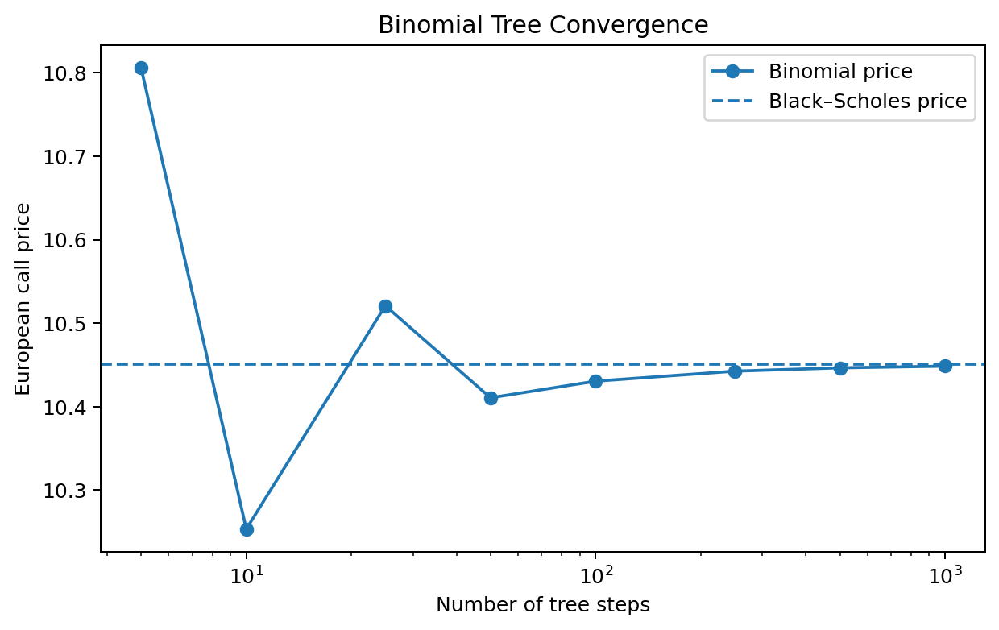
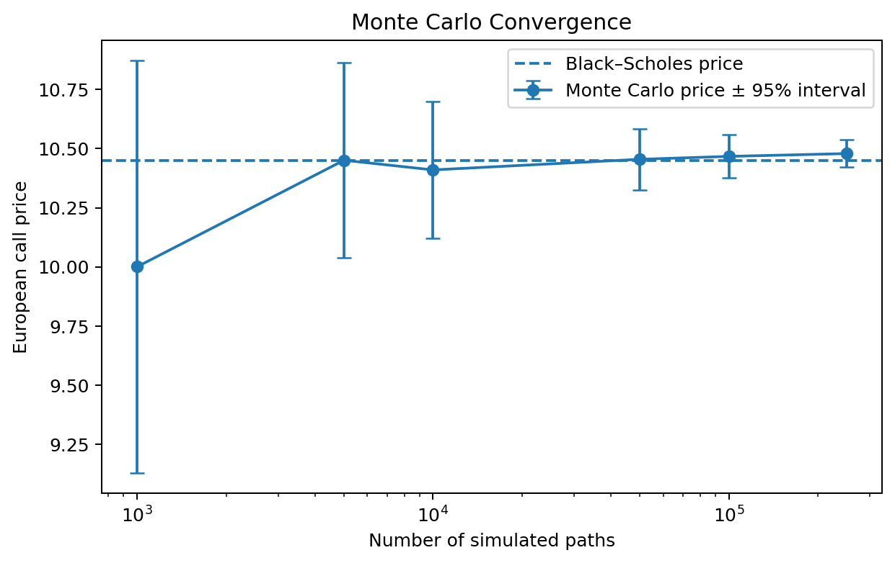
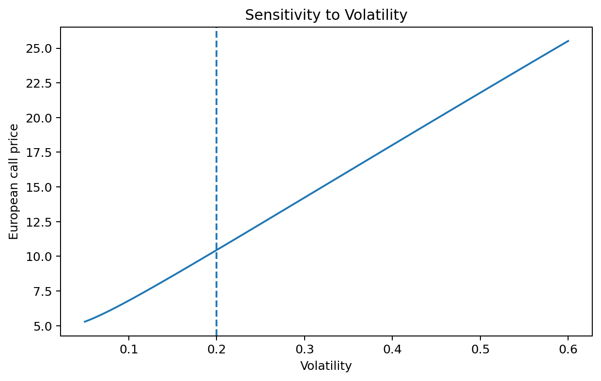
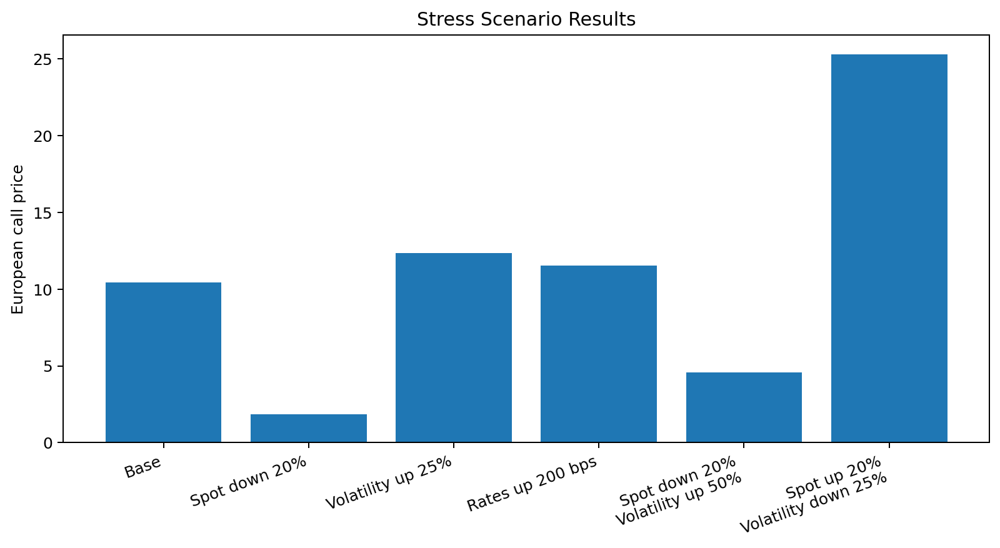

# Option Pricing Model Validation

A very simple Python project for pricing and independently validating European options.

The project implements Black–Scholes, a Cox–Ross–Rubinstein binomial tree, and Monte Carlo simulation, then compares their outputs through convergence tests, numerical checks, sensitivity analysis, and stress testing.

## Features

- European call and put pricing
- Black–Scholes analytical Greeks: delta, gamma, vega, theta, and rho
- Dividend-yield support
- Binomial-tree pricing
- Monte Carlo pricing with antithetic sampling and standard-error estimates
- Cross-model benchmarking
- Put–call parity and no-arbitrage checks
- Analytical Greeks checked against finite differences
- Sensitivity analysis across spot, volatility, rates, and maturity
- Defined market stress scenarios
- Automated tests with `pytest`

## Project structure

```text
option-pricing-model-validation/
├── src/
│   ├── __init__.py
│   ├── black_scholes.py
│   ├── binomial_tree.py
│   ├── monte_carlo.py
│   └── validation.py
├── notebooks/
│   ├── pricing_comparison.ipynb
│   └── sensitivity_stress_analysis.ipynb
├── tests/
│   ├── conftest.py
│   ├── test_pricing_models.py
│   └── test_validation.py
└── figures/
```

## Installation

Clone the repository and move into it:

```bash
git clone https://github.com/Anupam-Dasgupta/option-pricing-model-validation.git
cd option-pricing-model-validation
```

Create and activate a virtual environment:

```bash
python -m venv .venv
```

Windows:

```bash
.venv\Scripts\activate
```

macOS or Linux:

```bash
source .venv/bin/activate
```

Install the required packages:

```bash
pip install numpy pandas matplotlib pytest jupyter
```

## Quick example

```python
from src.black_scholes import (
    black_scholes_greeks,
    black_scholes_price,
)
from src.binomial_tree import binomial_price
from src.monte_carlo import monte_carlo_price

params = {
    "spot": 100,
    "strike": 100,
    "maturity": 1,
    "rate": 0.05,
    "volatility": 0.20,
    "dividend_yield": 0.0,
}

bs_price = black_scholes_price(
    **params,
    option_type="call",
)

tree_price = binomial_price(
    **params,
    option_type="call",
    steps=500,
)

mc_price, standard_error = monte_carlo_price(
    **params,
    option_type="call",
    paths=100_000,
    seed=42,
)

greeks = black_scholes_greeks(
    **params,
    option_type="call",
)

print("Black–Scholes:", bs_price)
print("Binomial:", tree_price)
print("Monte Carlo:", mc_price)
print("Monte Carlo standard error:", standard_error)
print("Greeks:", greeks)
```

For the base case above, the Black–Scholes call price is approximately `10.4506`, while the 500-step binomial price is approximately `10.4466`.

## Validation approach

The Black–Scholes model acts as the analytical reference for European options. The binomial and Monte Carlo implementations provide independent numerical benchmarks.

The validation checks cover:

1. Agreement across pricing methods
2. Binomial convergence as the number of steps increases
3. Monte Carlo convergence and standard-error behaviour
4. Put–call parity
5. No-arbitrage price bounds
6. Analytical Greeks versus central finite differences
7. Expected price behaviour when spot or volatility changes
8. Performance under defined stress scenarios

## Run the tests

From the repository root:

```bash
pytest -q
```

The current test suite covers known Black–Scholes values, numerical convergence, Monte Carlo accuracy, input validation, put–call parity, no-arbitrage bounds, Greek verification, and basic monotonicity checks.

## Run the notebooks

```bash
jupyter notebook
```

Open:

- `notebooks/pricing_comparison.ipynb`
- `notebooks/sensitivity_stress_analysis.ipynb`

## Example figures

### Binomial convergence



### Monte Carlo convergence



### Volatility sensitivity



### Stress scenarios



## Model assumptions

The Black–Scholes framework assumes:

- Lognormal asset prices
- Constant volatility and interest rates
- Continuous trading and frictionless markets
- No arbitrage
- Continuous dividend yield
- European exercise

These assumptions limit the model's ability to represent volatility smiles, jumps, transaction costs, discrete hedging, early exercise, and changing market conditions.
